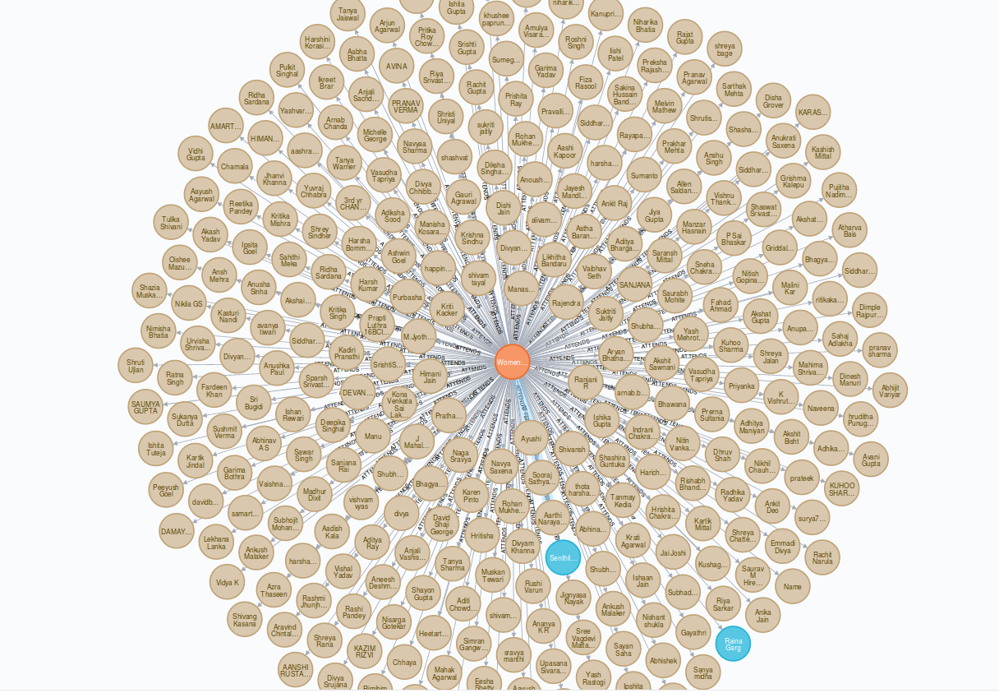

# Project Hades

The last event coordinator you will ever need

[](https://www.codefactor.io/repository/github/l04db4l4nc3r/project-hades) [](https://l04db4l4nc3r.github.io/Project-Hades/) [](https://github.com/GDGVIT/Hades_Admin_App.git) [](https://github.com/GDGVIT/Project-Hades-Frontend.git)

<br />

## Directions to run
---

<br/>

### Quick setup
Quick setup uses performat dockerfiles made from scratch. It directly runs the compiled binaries.

To `compile` binaries run

```bash
$ make
$ docker-compose -f docker-compose-light.yml build
$ docker-compose -f docker-compose-light.yml up -d neo4j
$ docker-compose -f docker-compose-light.yml up --d
```
<br/>

### Stable setup
Stable setup compiles binaries on a heavier container runs them using `watcher`. 

To run the setup simply do the following 

```bash
$ docker-compose build 
$ docker-compose up -d neo4j
$ docker-compose up -d
```

Go to `localhost:7474` to see if the *database* is running. You would have to create a new username and password the first time

<br/>

### Testing and documentation
To generate docs and testing, simply do the following

```bash
$ make docs
$ make test
```

<br/>
<br/>

### WomenTechies'19 database



<br />
<br />

### High level flow


